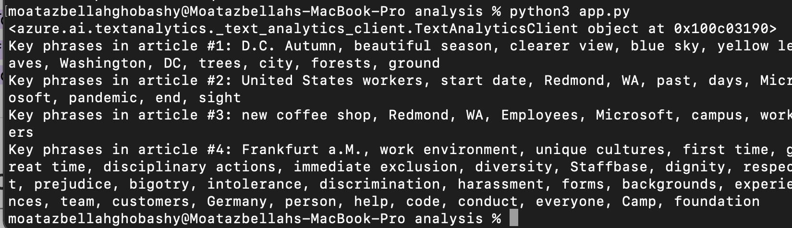
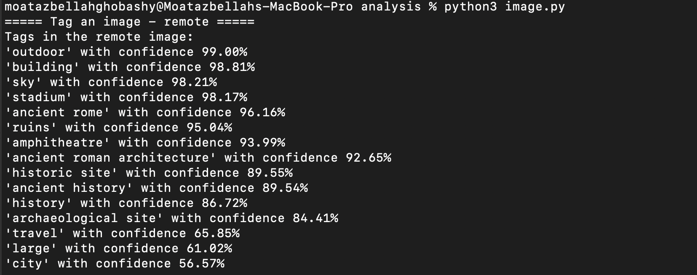

# Content Topic Classification

Content Classification analyzes a document/article and returns a list of content categories that apply to the text found in the document/article
Azure Cognitive services provide three ways in order to analayze/classify the topic

- [Custom text classification](https://docs.microsoft.com/en-us/azure/cognitive-services/language-service/custom-text-classification/overview)
- [Key phrase extraction](https://docs.microsoft.com/en-us/azure/cognitive-services/language-service/key-phrase-extraction/overview)
- [Image Analysis](https://docs.microsoft.com/en-us/azure/cognitive-services/computer-vision/overview-image-analysis)

## Custom text classification

Custom text classification allows users to create custom AI models that classify text into user-defined classes. Developers can iteratively label data, train, evaluate, and improve model performance by creating a custom text classification project before making it available for consumption.

There are two types of custom text classification:

- Single label classification
- Multi label classification

### Project development lifecycle

1. Define your schema
2. Label your data
3. Train the model
4. View the model's performance
5. Deploy the model
6. Classify text

[QuickStart](https://docs.microsoft.com/en-us/azure/cognitive-services/language-service/custom-text-classification/quickstart?tabs=multi-classification&pivots=language-studio)

## Key phrase extraction

Key phrase extraction is one of the capabilities provided by Azure Cognitive Service for Language, a cloud-based collection of machine learning and AI algorithms for developing intelligent applications that use written language. To quickly identify the main concepts in text, use key phrase extraction.

[QuickStart](https://docs.microsoft.com/en-us/azure/cognitive-services/language-service/key-phrase-extraction/quickstart?pivots=programming-language-python)

### Key phrase extraction example

The `app.py` file is a python application that can recognize key words and phrases in text.

## Image Analysis

A wide range of visual features can be extracted from your images using the Computer Vision Image Analysis service.

[QuickStart](https://docs.microsoft.com/en-us/azure/cognitive-services/computer-vision/quickstarts-sdk/image-analysis-client-library?tabs=visual-studio&pivots=programming-language-python)

### Image Analysis example

The `image.py` file is a python application that can recognize features i n the image.

